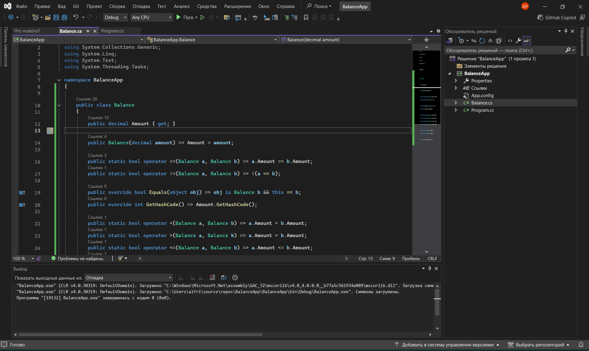
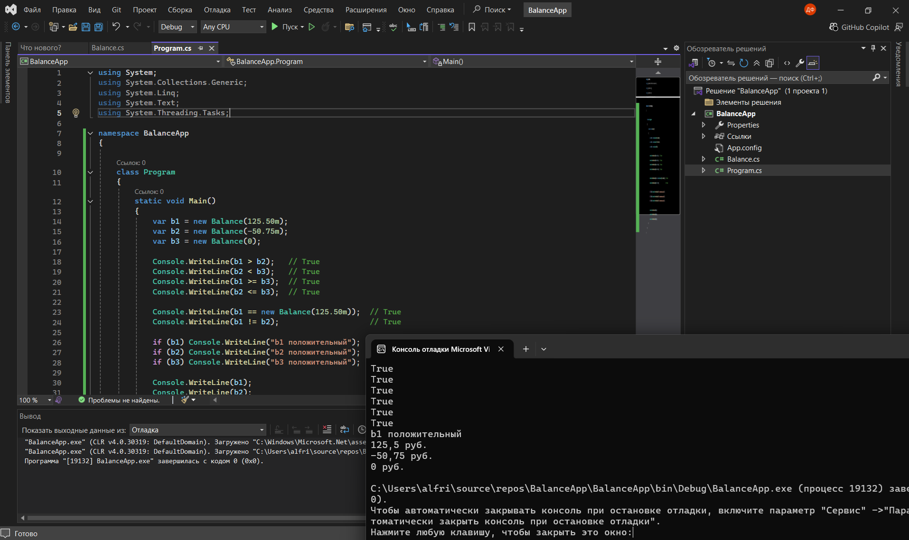

Задание «Контрольная точка №4 — перегрузка операторов отношения и true/false»

Вариант 1. Balance (баланс счёта)
Класс Balance хранит сумму на счёте (decimal Amount).
Конструктор Balance(decimal amount).
operator ==, operator != — сравнение по значению Amount. Переопределите Equals и GetHashCode.
operator <, operator >, operator <=, operator >= — сравнение по значению Amount.
operator true — баланс положительный (Amount > 0); operator false — баланс не положительный.
Переопределите ToString(), например: "125,50 руб.".

Код Balance.cs

Код Program.cs

